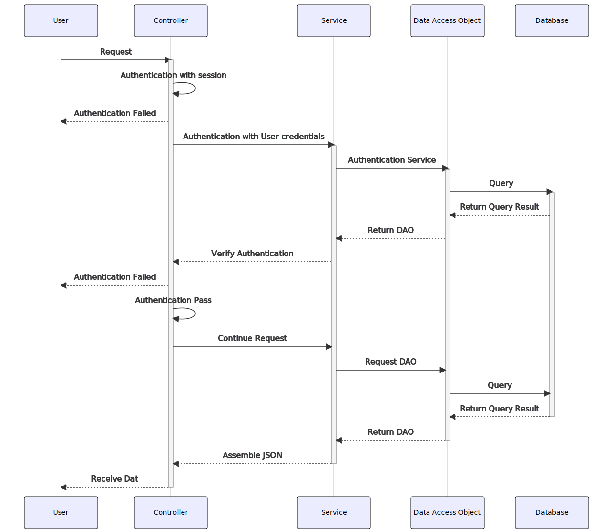

# Long-Term Care Assistant

> 2019 Final Year Project at Dongguan University of Technology

## Briefing
A resident management system built with [Vue.js](https://vuejs.org), [Flutter](https://flutter.dev) and [Spring Frameworks](https://spring.io) including user information, health management, geo-fence, announcement, etc. to assist in daily work at long-term care center.  

## Table of Content
- [Briefing](#briefing)
- [Architectures](#architectures)
  - [Web](#web)
  - [Backend](#backend)
  - [Mobile](#mobile)
- [Repositories](#repositories)


## Architectures


*Tools, Frameworks, Dependencies:*
```yml
web: 
 - Vue.js:
     Vue-core
     Vue-router
     Vuex
 - Bootstrap
mobile:
 - Flutter
backend:
 - Spring Boot
 - MyBatis
 - MySQL
```

### Web


### Backend

#### General Sequence Diagram: 


### Mobile


## Repositories
- [Web ↗️](https://github.com/puiiyuen/ltc-assistant-frontend)
- [Backend ↗️](https://github.com/puiiyuen/ltc-assistant-backend)
- [Mobile ↗️](https://github.com/puiiyuen/ltc-assistant-mobile)