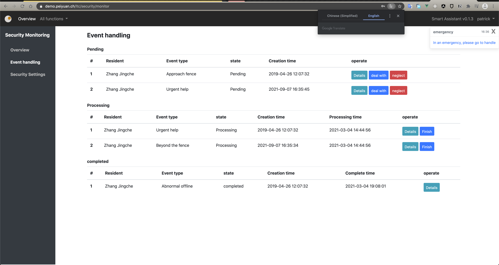
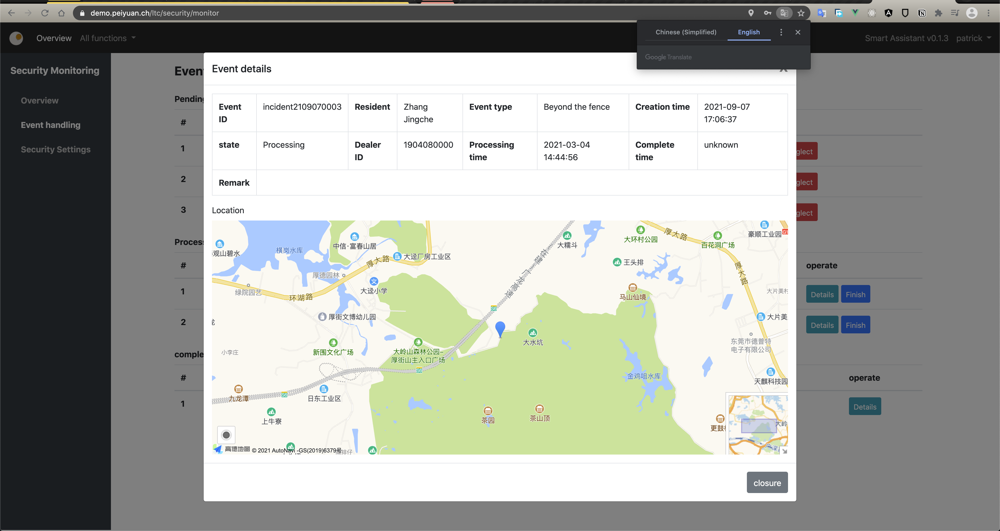
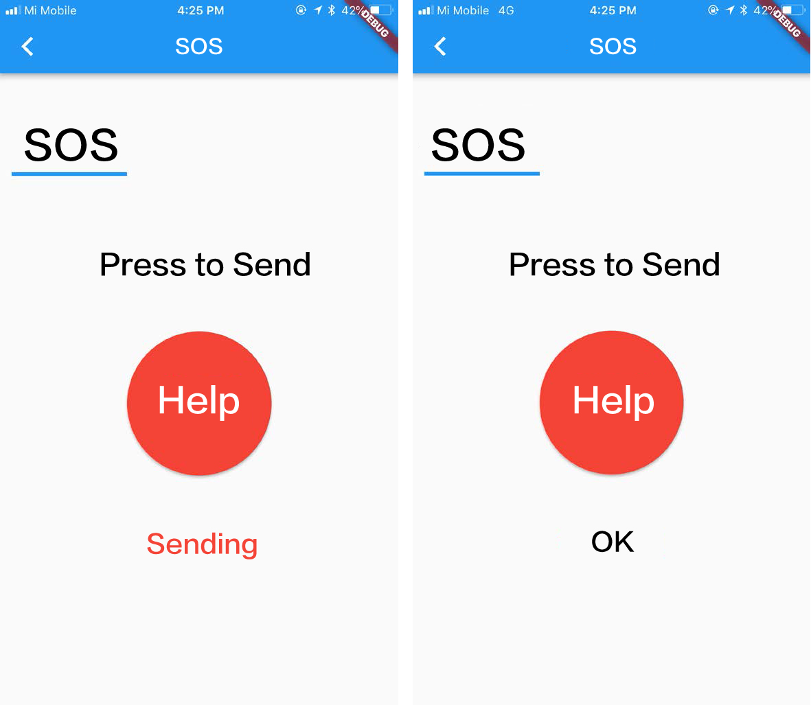

# Long-Term Care Assistant

> 2019 Final Year Project at Dongguan University of Technology

## Briefing
A resident management system built with [Vue.js](https://vuejs.org), [Flutter](https://flutter.dev) and [Spring Frameworks](https://spring.io) including user information, health management, geo-fence, announcement, etc. to assist in daily work at long-term care center.  

## Table of Content
- [Briefing](#briefing)
- [Architectures](#architectures)
  - [Web](#web)
  - [Backend](#backend)
  - [Mobile](#mobile)
- [Overall](#overall)
- [Live Demo](#live-demo)
- [Repositories](#repositories)

## Architectures


*Tools, Frameworks, Dependencies:*
```yml
web: 
 - Vue.js:
     Vue-core
     Vue-router
     Vuex
 - Bootstrap
mobile:
 - Flutter
backend:
 - Spring Boot
 - MyBatis
 - MySQL
```

### Web
It is a dashboard view for staff to manage all information. I use Vue.js to build a single-page application. Vue-router is imported to manage page routing. All static resources are hosted on the Nginx server. The application will initiate async requests to fetch data from the backend server on demand.

Below is an example of "Security Alert Center":


*<div align="center">e.g. Security Alert Center Dashboard</div>*


*<div align="center">e.g. Detail</div>*


### Backend
With Spring Boot and [MyBatis](https://mybatis.org/mybatis-3/), I can easily implement RESTful APIs by adding annotations: `@Controller`, `@Service`, `@Configuration`, `@Mapper` , etc. Controller and Service process most of the tasks. Mapper helps me pack up the data to a Data Access Object. 

Below is a sequence diagram of request process: 

![General Sequence Diagram](https://mermaid.ink/img/eyJjb2RlIjoic2VxdWVuY2VEaWFncmFtXG4gICAgVXNlci0-PitDb250cm9sbGVyOiBSZXF1ZXN0XG4gICAgQ29udHJvbGxlci0-PkNvbnRyb2xsZXI6IEF1dGhlbnRpY2F0aW9uIHdpdGggc2Vzc2lvblxuICAgIENvbnRyb2xsZXItLT4-VXNlcjogQXV0aGVudGljYXRpb24gRmFpbGVkXG4gICAgQ29udHJvbGxlci0-PitTZXJ2aWNlOiBBdXRoZW50aWNhdGlvbiB3aXRoIFVzZXIgY3JlZGVudGlhbHNcbiAgICBTZXJ2aWNlLT4-K0RhdGEgQWNjZXNzIE9iamVjdDogQXV0aGVudGljYXRpb24gU2VydmljZVxuICAgIERhdGEgQWNjZXNzIE9iamVjdC0-PitEYXRhYmFzZTogUXVlcnlcbiAgICBEYXRhYmFzZS0tPj5EYXRhIEFjY2VzcyBPYmplY3Q6ICBSZXR1cm4gUXVlcnkgUmVzdWx0XG4gICAgRGF0YSBBY2Nlc3MgT2JqZWN0LS0-PlNlcnZpY2U6IFJldHVybiBEQU9cbiAgICBTZXJ2aWNlLS0-PkNvbnRyb2xsZXI6IFZlcmlmeSBBdXRoZW50aWNhdGlvblxuICAgIENvbnRyb2xsZXItLT4-VXNlcjogQXV0aGVudGljYXRpb24gRmFpbGVkXG4gICAgQ29udHJvbGxlci0-PkNvbnRyb2xsZXI6IEF1dGhlbnRpY2F0aW9uIFBhc3NcbiAgICBDb250cm9sbGVyLT4-U2VydmljZTogQ29udGludWUgUmVxdWVzdFxuICAgIFNlcnZpY2UtPj5EYXRhIEFjY2VzcyBPYmplY3Q6IFJlcXVlc3QgREFPXG4gICAgRGF0YSBBY2Nlc3MgT2JqZWN0LT4-RGF0YWJhc2U6IFF1ZXJ5XG4gICAgRGF0YWJhc2UtLT4-LURhdGEgQWNjZXNzIE9iamVjdDogUmV0dXJuIFF1ZXJ5IFJlc3VsdFxuICAgIERhdGEgQWNjZXNzIE9iamVjdC0tPj4tU2VydmljZTogUmV0dXJuIERBT1xuICAgIFNlcnZpY2UtLT4-LUNvbnRyb2xsZXI6IEFzc2VtYmxlIEpTT05cbiAgICBDb250cm9sbGVyLS0-Pi1Vc2VyOiBSZWNlaXZlIERhdGFcbiAgICAgICAgICAgICIsIm1lcm1haWQiOnsidGhlbWUiOiJkZWZhdWx0In0sInVwZGF0ZUVkaXRvciI6ZmFsc2UsImF1dG9TeW5jIjp0cnVlLCJ1cGRhdGVEaWFncmFtIjpmYWxzZX0)

*<div align="center">General Sequence Diagram</div>*

### Mobile
Some features on the project proposal are required to run on the native platform. Compare to React Native, Weex and Flutter, Flutter is the best choice for me. 

The mobile application is for the residents at the long-term care center. The residents can use the app to receive announcements, medical reports, SOS, etc.

Below is an screenshot of sending SOS to the Security Alert Center:



*<div align="center">e.g. SOS</div>*

## Overall
It is my first full-stack project finished by myself.  Not so bad, but not so good.

I learned these frames by myself in the two months after class. During the learning stage, I read through documentations, checked out a bunch of demo applications and wrote my own codes based on the examples. I think I gained a lot during that period: 

- The first time I knew how to build RESTful API with Spring Boot.

- Set up a fancy web dashboard quickly with Vue.js and Bootstrap.

- Built Android and iOS applications at the same time by utilizing Flutter.

With limited understanding of those techniques, I started to build up this application. Luckily, it was done before the due date. However, the drawbacks of developing with limited experience are obviously:

- **No Specific Plans**: Most of the modules were built without planning in advance. Waste a lot of time on considering what to do and how to do when programming. 

- **No Standardized Documentations**: APIs were formed in a messy format and undocumented. It's not friendly for frontend development when invoking APIs. 
  
- **Unprofessional Solution**: Some features were implemented without in-deep consideration. Used `session` to manage user authentication and authorization. Once the server crashes, or if the application is deployed on a cluster, user cannot access the services properly.

- **Redundant Codes**: Some components were developed repeatedly. 

Although the project was done, I still keep learning and keep fixing up those cons as well. Mastering a skill from 0 to 1 is easy, but how to enlarge 1 to 10, 100, 1000... is my next step:)

## Live Demo
https://demo.peiyuan.ch/

## Repositories
- [Web ↗️](https://github.com/puiiyuen/ltc-assistant-frontend)
- [Backend ↗️](https://github.com/puiiyuen/ltc-assistant-backend)
- [Mobile ↗️](https://github.com/puiiyuen/ltc-assistant-mobile)